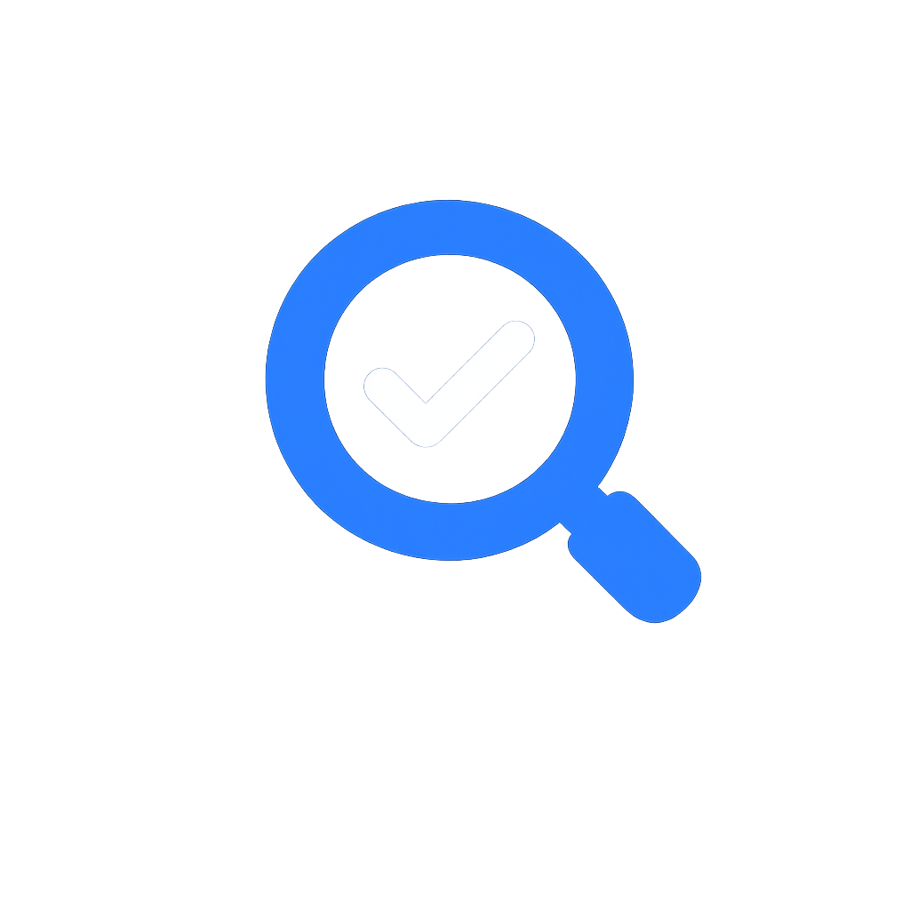

# QA Quest

<p align="center">
  
</p>

Plataforma gamificada para estudar Quality Assurance por meio de desafios, análises e simuladores práticos. O projeto também é um exercício de HTML, CSS, JavaScript e aprendizado assistido por IA.

## Fases disponíveis

- **Fase 1 — Fundamentos:** questionário com perguntas aleatórias e feedback explicativo.
- **Fase 2 — Análise de Requisitos:** fluxos, ambiguidades, critérios de aceitação e riscos.
- **Fase 3 — Simulador de Login:** execução funcional e registro de defeito.
- **Fase 4 — Plano de Testes:** definição de escopo, riscos, estratégia, prioridades e critérios de saída.

O progresso, XP, tentativas, tema e desbloqueio das fases são salvos no navegador.

## Como executar

O projeto não possui dependências ou processo de build. Clone ou baixe o repositório e abra `index.html` em um navegador moderno.

```bash
git clone URL_DO_REPOSITORIO
cd qa-quest
```

## Tecnologias

- HTML5 e CSS3;
- JavaScript e Web Components nativos;
- `localStorage`;
- Google Fonts.

## Estrutura

```text
qa-quest/
├── components/   # componentes reutilizáveis
├── core/         # progresso e persistência
├── pages/        # lógica de cada página
├── styles/       # estilos globais e das fases
├── index.html    # mapa da jornada
├── phase1.html   # Fase 1
├── phase2.html   # Fase 2
├── phase3.html   # Fase 3
└── phase4.html   # Fase 4
```

## Status

Protótipo funcional em desenvolvimento. Novas missões, simuladores e testes automatizados serão adicionados gradualmente.
